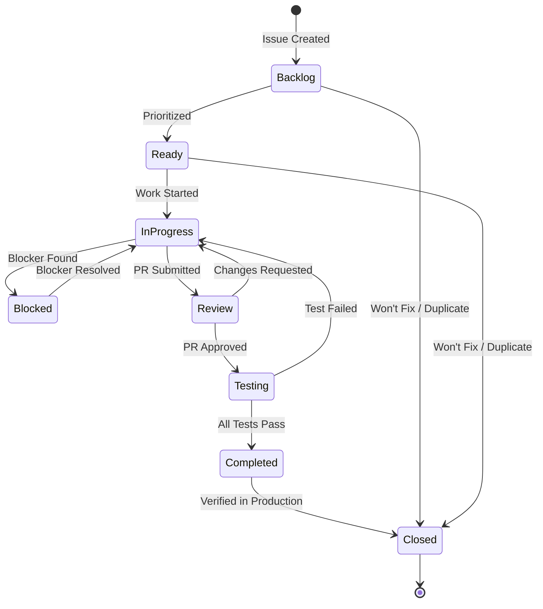

# GitHub Issue Workflow - Status Management and Automation

**Purpose**: Define how GitHub Issues are managed throughout the software development lifecycle, including status transitions, automation, and integration with GitHub MCP tools.

**Standards**: ISO/IEC/IEEE 12207:2017 (Configuration Management), ISO/IEC/IEEE 29148:2018 (Requirements Management)

## 📋 Issue Status Workflow

### Issue States and Lifecycle

GitHub provides two primary states: **Open** and **Closed**. We extend these with labels to track detailed status:

| Status Label | Meaning | When to Apply |
|--------------|---------|---------------|
| `status:backlog` | Issue created but not yet prioritized | Initial creation |
| `status:ready` | Prioritized and ready for work | After sprint planning |
| `status:in-progress` | Actively being worked on | When work begins |
| `status:review` | Implementation complete, awaiting review | PR submitted |
| `status:testing` | In verification/validation phase | Tests being executed |
| `status:blocked` | Work stopped due to dependency or issue | When blocker identified |
| `status:completed` | Fully implemented and verified | When PR merged and verified |
| `status:closed` | Issue closed (completed, duplicate, or won't fix) | Final closure |

### State Transitions



## 🤖 Using GitHub MCP to Manage Issue Status

### Tool: `mcp_io_github_git_issue_write`

**Purpose**: Create or update GitHub issues, including status changes.

**Parameters**:
```typescript
{
  method: 'create' | 'update',
  owner: string,          // Repository owner (e.g., 'zarfld')
  repo: string,           // Repository name (e.g., 'copilot-instructions-template')
  issue_number?: number,  // Required for 'update'
  title?: string,
  body?: string,
  state?: 'open' | 'closed',
  state_reason?: 'completed' | 'not_planned' | 'duplicate',
  labels?: string[],      // Add/update labels including status labels
  assignees?: string[],   // Assign users
  milestone?: number
}
```

### Common Status Update Scenarios

#### 1. Start Work on an Issue (Open → In Progress)

```python
# User starts work on REQ-F-AUTH-001 (Issue #123)
mcp_io_github_git_issue_write(
    method='update',
    owner='zarfld',
    repo='copilot-instructions-template',
    issue_number=123,
    labels=['type:requirement:functional', 'status:in-progress', 'priority:p0'],
    assignees=['zarfld']  # Assign to yourself
)
```

**Best Practice**: Always assign yourself when moving to `status:in-progress`.

#### 2. Submit PR (In Progress → Review)

```python
# After creating PR #45 for Issue #123
mcp_io_github_git_issue_write(
    method='update',
    owner='zarfld',
    repo='copilot-instructions-template',
    issue_number=123,
    labels=['type:requirement:functional', 'status:review', 'priority:p0']
)

# Add comment linking to PR
mcp_io_github_git_add_issue_comment(
    owner='zarfld',
    repo='copilot-instructions-template',
    issue_number=123,
    body='Implementation complete. See PR #45 for review.'
)
```

#### 3. Tests Pass (Testing → Completed)

```python
# After all tests pass
mcp_io_github_git_issue_write(
    method='update',
    owner='zarfld',
    repo='copilot-instructions-template',
    issue_number=123,
    labels=['type:requirement:functional', 'status:completed', 'priority:p0']
)

mcp_io_github_git_add_issue_comment(
    owner='zarfld',
    repo='copilot-instructions-template',
    issue_number=123,
    body='✅ All tests passed. Implementation verified. Closing issue.\n\nVerified by: #89, #90'
)
```

#### 4. Close Issue (Completed → Closed)

```python
# Close with 'completed' reason
mcp_io_github_git_issue_write(
    method='update',
    owner='zarfld',
    repo='copilot-instructions-template',
    issue_number=123,
    state='closed',
    state_reason='completed',  # Options: 'completed', 'not_planned', 'duplicate'
    labels=['type:requirement:functional', 'status:closed', 'priority:p0']
)
```

#### 5. Mark as Blocked

```python
# Issue blocked waiting for dependency #45
mcp_io_github_git_issue_write(
    method='update',
    owner='zarfld',
    repo='copilot-instructions-template',
    issue_number=123,
    labels=['type:requirement:functional', 'status:blocked', 'priority:p0']
)

mcp_io_github_git_add_issue_comment(
    owner='zarfld',
    repo='copilot-instructions-template',
    issue_number=123,
    body='⚠️ **Blocked**: Waiting for #45 (ADR-SECU-001: JWT Authentication) to be completed.'
)
```

## 🔄 Automated Status Updates via GitHub Actions

### Workflow: Auto-Update Issue Status

Create `.github/workflows/issue-status-automation.yml`:

```yaml
name: Issue Status Automation

on:
  pull_request:
    types: [opened, closed, reopened]
  issues:
    types: [assigned, unassigned]

jobs:
  update-issue-status:
    runs-on: ubuntu-latest
    permissions:
      issues: write
      pull-requests: read
    
    steps:
      - name: Update status when assigned
        if: github.event_name == 'issues' && github.event.action == 'assigned'
        uses: actions/github-script@v7
        with:
          script: |
            // Get current labels
            const issue = await github.rest.issues.get({
              owner: context.repo.owner,
              repo: context.repo.repo,
              issue_number: context.issue.number
            });
            
            // Remove old status labels and add 'in-progress'
            const labels = issue.data.labels
              .map(l => l.name)
              .filter(l => !l.startsWith('status:'));
            
            labels.push('status:in-progress');
            
            await github.rest.issues.update({
              owner: context.repo.owner,
              repo: context.repo.repo,
              issue_number: context.issue.number,
              labels: labels
            });
            
            await github.rest.issues.createComment({
              owner: context.repo.owner,
              repo: context.repo.repo,
              issue_number: context.issue.number,
              body: '🚀 Issue moved to **In Progress** (assigned to @' + context.payload.assignee.login + ')'
            });
      
      - name: Update status when PR opened
        if: github.event_name == 'pull_request' && github.event.action == 'opened'
        uses: actions/github-script@v7
        with:
          script: |
            // Extract issue numbers from PR body
            const body = context.payload.pull_request.body || '';
            const issueNumbers = [...body.matchAll(/#(\d+)/g)].map(m => parseInt(m[1]));
            
            for (const issueNum of issueNumbers) {
              try {
                const issue = await github.rest.issues.get({
                  owner: context.repo.owner,
                  repo: context.repo.repo,
                  issue_number: issueNum
                });
                
                // Update to 'review' status
                const labels = issue.data.labels
                  .map(l => l.name)
                  .filter(l => !l.startsWith('status:'));
                
                labels.push('status:review');
                
                await github.rest.issues.update({
                  owner: context.repo.owner,
                  repo: context.repo.repo,
                  issue_number: issueNum,
                  labels: labels
                });
                
                await github.rest.issues.createComment({
                  owner: context.repo.owner,
                  repo: context.repo.repo,
                  issue_number: issueNum,
                  body: '🔍 PR #' + context.payload.pull_request.number + ' opened for review.'
                });
              } catch (error) {
                console.log(`Could not update issue #${issueNum}: ${error.message}`);
              }
            }
      
      - name: Update status when PR merged
        if: github.event_name == 'pull_request' && github.event.pull_request.merged == true
        uses: actions/github-script@v7
        with:
          script: |
            // Extract issue numbers from PR body
            const body = context.payload.pull_request.body || '';
            const issueNumbers = [...body.matchAll(/(?:Fixes|Closes|Resolves|Implements)\s+#(\d+)/gi)]
              .map(m => parseInt(m[1]));
            
            for (const issueNum of issueNumbers) {
              try {
                const issue = await github.rest.issues.get({
                  owner: context.repo.owner,
                  repo: context.repo.repo,
                  issue_number: issueNum
                });
                
                // Update to 'testing' status (don't close yet, wait for verification)
                const labels = issue.data.labels
                  .map(l => l.name)
                  .filter(l => !l.startsWith('status:'));
                
                labels.push('status:testing');
                
                await github.rest.issues.update({
                  owner: context.repo.owner,
                  repo: context.repo.repo,
                  issue_number: issueNum,
                  labels: labels
                });
                
                await github.rest.issues.createComment({
                  owner: context.repo.owner,
                  repo: context.repo.repo,
                  issue_number: issueNum,
                  body: '✅ PR #' + context.payload.pull_request.number + ' merged. Moving to testing phase.'
                });
              } catch (error) {
                console.log(`Could not update issue #${issueNum}: ${error.message}`);
              }
            }
```

### Workflow: Close Issues After CI Success

Add to `.github/workflows/ci-standards-compliance.yml`:

```yaml
  close-completed-issues:
    name: Close Completed Issues
    runs-on: ubuntu-latest
    needs: [compliance-report]  # Run after all tests pass
    if: github.event_name == 'push' && github.ref == 'refs/heads/master'
    permissions:
      issues: write
    
    steps:
      - name: Close issues in testing status
        uses: actions/github-script@v7
        with:
          script: |
            // Find all issues with 'status:testing'
            const issues = await github.rest.issues.listForRepo({
              owner: context.repo.owner,
              repo: context.repo.repo,
              state: 'open',
              labels: 'status:testing',
              per_page: 100
            });
            
            for (const issue of issues.data) {
              // Update to completed and close
              const labels = issue.labels
                .map(l => l.name)
                .filter(l => !l.startsWith('status:'));
              
              labels.push('status:completed');
              
              await github.rest.issues.update({
                owner: context.repo.owner,
                repo: context.repo.repo,
                issue_number: issue.number,
                state: 'closed',
                state_reason: 'completed',
                labels: labels
              });
              
              await github.rest.issues.createComment({
                owner: context.repo.owner,
                repo: context.repo.repo,
                issue_number: issue.number,
                body: '✅ All CI checks passed. Issue completed and closed.\n\nCommit: ' + context.sha.substring(0, 7)
              });
            }
```

## 🎯 GitHub Copilot Agent Integration

### When to Update Issue Status Automatically

Copilot can suggest or perform status updates when:

1. **User assigns themselves to an issue** → Suggest moving to `status:in-progress`
2. **User creates a PR** → Suggest moving linked issues to `status:review`
3. **PR is merged** → Suggest moving to `status:testing`
4. **All tests pass** → Suggest closing with `status:completed`
5. **User mentions a blocker** → Suggest marking as `status:blocked`

### Example Copilot Workflow

```markdown
User: "I'm starting work on issue #123"

Copilot: "I'll update the issue status to in-progress and assign it to you."

[Copilot executes]
mcp_io_github_git_issue_write(
    method='update',
    issue_number=123,
    labels=['type:requirement:functional', 'status:in-progress', 'priority:p0'],
    assignees=['zarfld']
)

Copilot: "✅ Issue #123 is now In Progress and assigned to you. What would you like to implement first?"
```

## 📊 Status Tracking and Metrics

### Query Issues by Status

```bash
# List all in-progress issues
gh issue list --label "status:in-progress"

# List blocked issues
gh issue list --label "status:blocked"

# List issues ready for work
gh issue list --label "status:ready" --assignee "@me"
```

### GitHub Projects Integration

Create a GitHub Project board with columns matching status labels:

- **Backlog** → `status:backlog`
- **Ready** → `status:ready`
- **In Progress** → `status:in-progress`
- **Review** → `status:review`
- **Testing** → `status:testing`
- **Done** → `status:completed`

Issues automatically move between columns when status labels change.

## ✅ Best Practices

### Always Do
✅ Update status when starting work (assign + `status:in-progress`)  
✅ Link PRs to issues with `Fixes #N` or `Implements #N`  
✅ Add comments when changing status to blocked  
✅ Verify tests before closing issues  
✅ Use `state_reason: 'completed'` when closing successfully implemented issues  
✅ Keep status labels synchronized with actual work state  

### Never Do
❌ Start work without assigning yourself  
❌ Close issues without verification  
❌ Leave issues in `status:in-progress` for >3 days without updates  
❌ Forget to link PRs to issues  
❌ Mix multiple unrelated fixes in one PR  
❌ Close issues with `state_reason: 'not_planned'` without explanation  

## 🔗 Integration with Traceability

Status updates should trigger traceability checks:

- **Moving to Review** → Validate all traceability links present
- **Moving to Testing** → Ensure TEST issues exist and link back
- **Moving to Completed** → Verify bidirectional traceability complete
- **Closing** → Generate traceability report and archive

## 📚 Related Documentation

- [CI/CD Workflows](ci-cd-workflows.md) - Automated traceability checks
- [Root Copilot Instructions](../.github/copilot-instructions.md) - Issue-driven development
- [Lifecycle Guide](lifecycle-guide.md) - Phase-specific issue workflows
- [GitHub Issues Traceability](../docs/improvement_ideas/using_github_issues_as_infrastructure_for_REQ_Tracability.md) - Detailed traceability patterns

---

**Version**: 1.0  
**Last Updated**: 2025-11-26  
**Maintained By**: Standards Compliance Team
